<!-- ══════════════════════════════════════════════════════════ -->
<!--   ZAEX — REGULATORY INTELLIGENCE ARCHITECT               -->
<!--   GitHub Profile README — Production Grade               -->
<!--   HOW TO USE:                                            -->
<!--   1. Upload /assets/*.svg files to your repo root        -->
<!--   2. Replace dhanu-nagarajan in stats URLs          -->
<!--   3. Update LinkedIn URL                                 -->
<!-- ══════════════════════════════════════════════════════════ -->

 

 

---

 

---

## ⚡ Tech Stack

<!-- Row 1 -->

<!-- Row 2 -->

 

---

## 📡 Telemetry Feed

&nbsp;&nbsp;

 

 

 

---

 

---

## 🚀 Active Systems

| ⚖️ TaxTech Engine | 🤖 AI Agents | 🌍 Virtual Worlds |
|:---:|:---:|:---:|
| Regulatory Intelligence @ Solique | LLM Workflow Automation | 300M+ Visits — Roblox |
| RAG · BM25 · Vector · Audit Trails | Orchestration · Safety · Governance | Real-time Systems · ML Mechanics |
|  |  |  |

 

---

## 🔗 Uplink Channels

&nbsp;

&nbsp;

 

---

<!--
══════════════════════════════════════════════════════════
  SETUP CHECKLIST
══════════════════════════════════════════════════════════

  REQUIRED FILES TO UPLOAD TO YOUR REPO:
  ├── README.md          ← this file
  └── assets/
      ├── banner.svg     ← animated ZAEX hologram header
      ├── terminal.svg   ← animated compliance console bio
      ├── pipeline.svg   ← animated data flow diagram
      ├── skills.svg     ← animated skill bars
      └── outro.svg      ← system online outro

  REPLACE THESE PLACEHOLDERS:
  • dhanu-nagarajan  → your actual GitHub handle (x4 spots)
  • progamedev         → your LinkedIn URL slug

  ALL SVG ANIMATIONS WORK BECAUSE:
  • SVG files are served as 
  • CSS @keyframes inside SVG files are fully supported
  • No JavaScript required, no inline SVG stripping
  • GitHub renders SVG CSS animations correctly this way

══════════════════════════════════════════════════════════
-->
