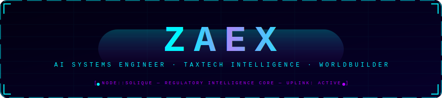
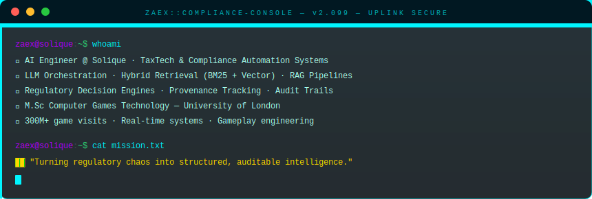
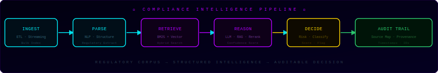

<!-- ══════════════════════════════════════════════════════════ -->
<!--   ZAEX — REGULATORY INTELLIGENCE ARCHITECT               -->
<!--   GitHub Profile README — Production Grade               -->
<!-- ══════════════════════════════════════════════════════════ -->

<strong>AI Engineer at AskSolique</strong>, building intelligent search and retrieval systems for regulatory compliance. 
I design hybrid search pipelines that combine BM25 sparse retrieval with dense vector search across Elasticsearch and Qdrant, backed by RAG orchestration, reranking, and LLM-powered reasoning to surface precise, auditable answers from unstructured regulatory data.

<em>M.Sc. Computer Games Technology, University of London</em> 
Previously built game systems serving <strong>300M+ player visits</strong> on Roblox. Real-time state management, ML-driven mechanics, and large-scale concurrent systems.

<em>"Turning regulatory chaos into structured, auditable intelligence."</em>

---

---

## What I Build

| ⚖️ Regulatory Intelligence | 🤖 AI Agent Systems | 🌍 Scale Background |
|:---|:---|:---|
| Hybrid search (BM25 + dense vector), RAG pipelines, reranking, and LLM reasoning for tax compliance at **AskSolique**. Full audit trail from ingestion to decision. | LLM orchestration with safety guardrails, governance controls, and structured output validation. | 300M+ visits across Roblox titles. Real-time multiplayer systems, economy balancing, ML-driven mechanics. |
| RAG · BM25 + Vector · Elasticsearch · Qdrant · PostgreSQL | Orchestration · Guardrails · Evaluation · Governance | Luau · Distributed State · Low-Latency Event Systems |
|  |  |  |

---

---

## Tech Stack

---

## GitHub Activity

 

---

## Connect

&nbsp;

&nbsp;

<!--
══════════════════════════════════════════════════════════
  SETUP CHECKLIST
══════════════════════════════════════════════════════════

  REQUIRED FILES TO UPLOAD TO YOUR REPO:
  ├── README.md          ← this file
  └── assets/
      ├── banner.svg     ← animated ZAEX hologram header
      ├── terminal.svg   ← animated compliance console bio
      └── pipeline.svg   ← animated data flow diagram

  REPLACE THESE PLACEHOLDERS:
  • dhanu-nagarajan  → your actual GitHub handle (x2 spots)
  • progamedev         → your LinkedIn URL slug

  ALL SVG ANIMATIONS WORK BECAUSE:
  • SVG files are served as 
  • CSS @keyframes inside SVG files are fully supported
  • No JavaScript required, no inline SVG stripping
  • GitHub renders SVG CSS animations correctly this way

══════════════════════════════════════════════════════════
-->
